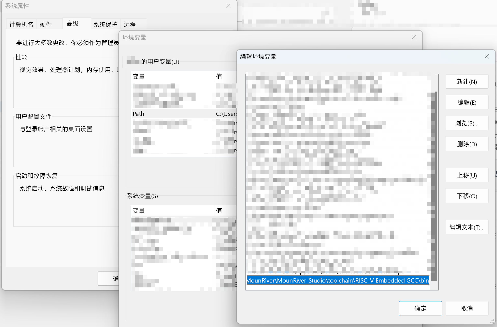

# CH32V-CLion-Tutorial

这篇文章教你如何使用 CLion 搭建 CH32 RISC-V 的开发环境。

### 1. 准备工作

- 准备好 CLion
- 安装和安装 [MounRiver Studio](http://www.mounriver.com/download)，对于 Linux 和 macOS 可能还需单独下载其中的工具链

> 以下将以 Windows 为例操作，其他操作系统类似

### 2. 设置环境变量

在 PATH 中添加 MounRiver Studio 所附带的 RISC-V Embedded GCC（`MounRiver_Studio/toolchain/MounRiver_Studio/toolchain`）。

### 3. CLion 设置

- 设置 OpenOCD 为 `MounRiver_Studio/toolchain/OpenOCD/bin/openocd.exe`（Windows），其他操作系统就不带 .exe

### 4. 编译及烧录

1. 使用 MounRiver Studio 建立工程，无需进行编译，**这步之后无需再使用 MounRiver Studio**
2. 复制本项目中的 `CMakeLists.txt` 到建立的工程中
3. 如果你的芯片不是 CH32V307，需修改其中的 `"Startup/startup_ch32v30x_D8C.S"` 到你使用的芯片对应的文件
4. 使用 CLion 打开项目
5. 在 Run/Debug configuration 中新增一个 OpenOCD Download/Run configuratiuon（如果它自动建立了就修改），Board config file 选择 `MounRiver_Studio/toolchain/OpenOCD/bin/wch-riscv.cfg`
   
   

6. 如无问题，现在就应该可以进行编译、烧录及调试了（锤子图标是编译，箭头图标是烧录，虫子图标是烧录及开启 GDB 调试）
   
   

7. 其他操作请参考 CLion 及 CMake 的文档，例如添加新的文件需对 `CMakeLists.txt` 进行修改，修改后需 "Reload CMake project"